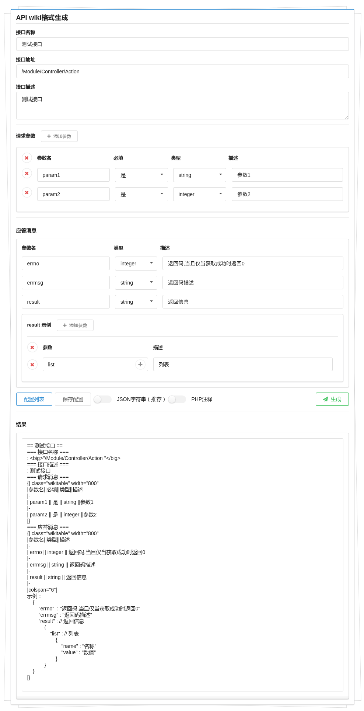

# Api to Wiki Doc

> 一个简单生成wiki或php文档格式的工具
>
> A simple tool for generating wiki or PHP document formats

## Install

```shell
## php
php -S <addr>:<port>
## apache or nginx
```

## Preview



## License
api-to-wiki-doc is open source and released under the MIT Licence.

Copyright (c) 2017 FangYutao